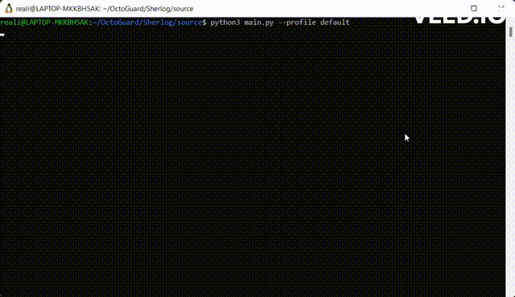

# Sherlog


## Description
Sherlog assess the logging gap of an AWS cloud environment. It scans for resources and checks if they are logging according to security best practices and in case they are, it checks the retention period of those logs. 
 - In case it detects resources that are not properly logging, sherlog gives recomendation on how to remidiate them.
 - In case of resources that are logging, sherlog evaluates the retention period if it's prperly configured and cost effective

Sherlog will help you reducing the loggin gap on your AWS enviroment!

AWS services covered by Sherlog:
- S3
- Cloudfront
- RDS Databases
- ELBv2
- CloudWatch (checks log group retention policy)

To come:
- DynamoDB
- EC2
- Redshift

## Setup
### Install with TestPypi (not yet realeased in Pypi)
```
python3 -m pip install --index-url https://test.pypi.org/simple/ sherlog
```
### Git clone project
```
pip install -r requirements.txt
cd source
python3 main.py --help
```

### Install with pypi (Soon)
```
pip install sherlog
```

### Sherlog will require at least a an AWS profile with read permissions, the AWS ***SecurityAudit*** permissions are good option
## How to use

Sherlog does not have mandatory arguments. If no profile is given, sherlog will assume "default" AWS profile
Usage:
```
sherlog --profile <profile> | --assume <arn role> [options]
```

Select a set of regions:
```
sherlog --profile <profile> -r us-west-2 -r us-east-1
```

Select if you want to evaluate retention period of audit logs:
```
sherlog --profile <profile> --retention
```
## Integrations tests
In case you want you to have an overview of what results are expectted feel free to use this TF code which provisions all resources covered by sherlog

## Collaborate
Feel free to Open PR's and contribute to sherlog!
#### Rules
- If you want to add a new feature, open a PR with a branch name starting with **feature:**
- If you want to fix an issue from *issues*, open a PR with a branch name starting with **fix-issue-ID:**
